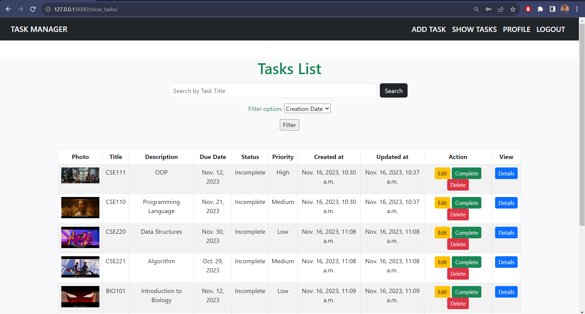
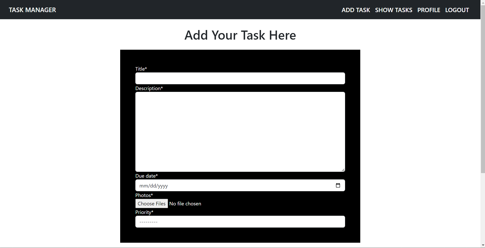

# <p align="center">Task Manager ( A Task Management Solution )</p>

Task Manager is a web application built with Django, designed to help users manage and organize their tasks efficiently.

## Features/Functionalities

### User Authentication
- **Registration:** Users can register for an account by providing a username, email, and password.
- **Login:** Registered users can log in using their credentials.

### Home Page
- Upon successful login, users are directed to the home page displaying a list of tasks.

### Task Properties
- **Title, Description, and Due Date:** Users can create tasks with a title, description, and due date.
- **Multiple Photos:** Tasks support multiple photo attachments with options to add and delete images.
- **Priority:** Tasks can be assigned a priority level (Low, Medium, High).
- **Completion Status:** Users can mark tasks as complete or incomplete.
- **Creation Date:** The application stores the date and time of task creation.
- **Last Update :** A feature to track the last update date and time.

### Task List Page
- **Search and Filter:**
  - Users can search tasks by title.
  - Tasks can be filtered by creation date, due date, priority, and completion status.

### Task Details Page
- Each task has a details page displaying all information, including attached photos.

### Task Update
- Users have the option to update tasks, modifying fields such as priority, due date, etc.

### Task Deletion
- Task deletion is implemented with a confirmation prompt to avoid accidental deletions.

### Additional Fields/Models
- Additional fields or models can be added based on specific project needs.

### Profile Page
- Users have a profile page displaying their information, including username, email, first name, and last name.

### Password Change
- Users can change their passwords securely.

## Screenshots





## Installation

1. Clone the repository:

    ```bash
    git clone https://github.com/your-username/task-manager.git
    cd task-manager
    ```

2. Create a virtual environment and install dependencies:

    ```bash
    python -m venv venv
    source venv/bin/activate   # On Windows, use 'venv\Scripts\activate'
    pip install -r requirements.txt
    ```

3. Set up the database:

    ```bash
    python manage.py migrate
    ```

4. Create a superuser account:

    ```bash
    python manage.py createsuperuser
    ```

5. Run the development server:

    ```bash
    python manage.py runserver
    ```

6. Visit `http://127.0.0.1:8000` in your web browser to access the application.

## Contributing

Contributions are welcome! Feel free to open issues and pull requests.

